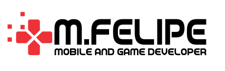

# Hi there 👋, I'm Felipe Ferreira

    <!-- TODO: Change to the "mfelipe-logo-light.svg" when github allows image by themes: (dark, light...) -->
    

  

:iphone: Mobile and Game developer | Master's Degree in Game development

  &nbsp;&nbsp;
  &nbsp;&nbsp;
  &nbsp;&nbsp;
  

  

Analyst, curious about new technologies. My aim is related with **game** and **mobile** apps development using technologies/platforms like `Android`, `IOS`, `Unity3D` and `Unreal Engine`, using Agile methodologies and Lean concepts.

## Portfolio

You can see game projects and mobile apps that I worked as a programmer on 

<!---->

## :iphone: Platforms

  
  
  

## Stacks: 

  

## Profile Visits:

    
<strong>📦 Published Packages</strong>

| Name                 | A short summary                              | Install   | Languages |
| -------------------- | -------------------------------------------- | --------- | --------- |
| [Surface Reconstruction](https://pypi.org/project/surface-reconstruction) | Import a point cloud file and perform poisson 3D surface reconstruction algorithms  |  |  |
| [Cordova Plugin Native View](https://github.com/mfdeveloper/BrazilHolidays.Net)   | Starts native view or another app, from a cordova app.   |  | 
   
|
| [P5 Scene Manager](https://www.npmjs.com/package/p5.scenemanager) | Fork: create p5.js games with multiple states/scenes |  |  |
| [P5 Gui Variables](https://github.com/mfdeveloper/p5.gui) | Fork: generates a graphical panel for each of your variables |  |  |
<!-- | Content Cell         | Content Cell                                | link | link | -->

  

    
<strong> Github Packages</strong>

| Name                 | A short summary                              | Languages/Platforms |
| -------------------- | -------------------------------------------- | --------- |
| [Unity Vibration](https://github.com/mfdeveloper/Vibration/tree/upm-android-haptics) | Fork: Native plugin for Unity for iOS and Android. Use custom vibrations HAPTICS on mobile  |   |
| [Unity Touch Screen Areas](https://github.com/mfdeveloper/Unity.Lean.Touch.Extensions.ScreenAreas) | Execute an action when the user touch in some areas/sides of mobile phone  |   |
| [Godot Isometric](https://github.com/mfdeveloper/godot-isometric-framework) | Collection of plugins to create isometric games like RTS, RPG grid-base movement... |  |
<!-- | Content Cell         | Content Cell                                | link | link | -->
  

<!--
**mfdeveloper/mfdeveloper** is a ✨ _special_ ✨ repository because its `README.md` (this file) appears on your GitHub profile.

Here are some ideas to get you started:

- 🔭 I’m currently working on ...
- 🌱 I’m currently learning ...
- 👯 I’m looking to collaborate on ...
- 🤔 I’m looking for help with ...
- 💬 Ask me about ...
- 📫 How to reach me: ...
- 😄 Pronouns: ...
- ⚡ Fun fact: ...
-->
